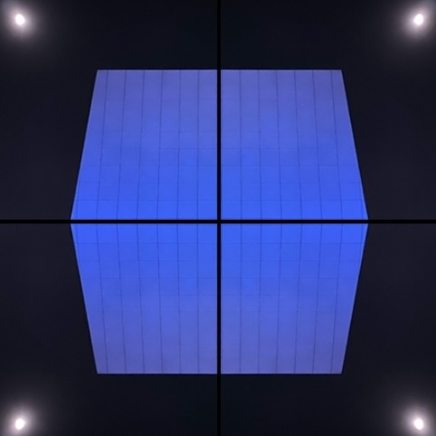

# How To

Learning to sail a vessel requires a dilated perception of the utility of time, the movement through space, and the shadow of illumination.

Imagine the wall clock at your giant boyfriend's house that you removed from the wall then placed on a glass table. As you admire the artist's design, the distribution of Roman numerals around the clock's circumference encourages your love for reason that invites a desire for logical content. This world is where you can search for the knowledge and a spirit to understand the choices made by time's original architects.

The laws of nature cause the glass table to reflect the sounds of time that tick slightly louder than you can remember. For a moment, you dream about the center of our temporal reality. Memories of concept are the artist's materials brought to Earth. This canvas is a special sequence of infinities. You have arrived. The destination renders a central location in time just for you. Did you not wonder? Is curiosity not a question? Is a question asked without the desire for an answer? Does an answer not provide completion?

The glass is now the sea. The numerals are now the horizon. You, myself, and the reader are now sailing a vessel on an ocean and your giant boyfriend suddenly feels closer.

However close he may feel to you, you cannot see him on this sailboat. Concepts of proximity seem different and that is a troubling thought in time, but you wonder. If a single proof in nature fades into its counterexample, then the total logical construct conceived by humans will collapse unless redeemed with the truth in uncertainty.

The Oblivion. Moments referred to as seconds, or defined as hours, or recorded as days are enhanced. Are references, definitions, and recordings not the same paradigm? Would you include human memories on that list for just the same reason? If memories are the arbiters of personal truth, then would you include conceivable ideas of future and of past together into the present? Is presence now? Where are you? Is it emotional? The Singularity.

If one lunar arch across the night sky can represent one full unit of measurement, then it explains precisely what human observation is - a measurement.

You can try to count the minutes until sunset or count the hours of the moon along its temporal arch across the sky, but how can you prove consistency in their movements? If observations can be asymptotic or exponential, are they opposites? Would a more accurate opposition to these two be something resembling a constant? If something is never constant, then would everything in its superposition be both asymptotic and exponential at the same time? If time is a misunderstanding of nature, then what?

The enhancement you feel, then, can only serve your imagination. This still grants a utility in the human concept of moment realized as anticipation, but if anticipation is emotion, then the utility of moment is more clear to us when simplified into love. How else can we describe the desire we have to be?

The observation of the moon in Earth's orbit is the catalyst to all human intellectual effort, but to observe consistency, in anything other than God, is the plight towards ignorance.

For this, _is_.

This is the human condition - a timeless observation void of absolutes. Perhaps the embrace of uncertainty should be cherished because two can live in a peaceful embrace protected by their carnal awareness of truth. Communication is reciprocal emotion that may yield their intent if and only if their embark shared an initial space to wonder. All remaining endeavors may not resolve, leaking memories of illusion lost in time's land of loops ruled by entropy.

At sea, nature anxiously waits for your choice. When you meet her there, she requests your consideration of the endless corridors provided for the wonders of your imagination. Please know that, if you desire a release from excessiveness, then you might find comfort in knowing that the elements in nature have intent. They encourage your powers of observation and if they bring despair, remember that the truth will set you free, but first it will piss you off.

You are alone on your sailboat with no land on the horizon. That is when you remember the wall clock. The numerals once again appear on the horizon of the Earth. You are left with two celestial bodies in space, your worldly existence, and a spiritual presence that you call love. You can learn how to how to sail, but the ocean and the wind and the stars are there for everyone. That truth is real, but what if the moon and the wind was also only for you? Would you live in that moment?

For myself, the pursuit of happiness is everything all at once, but that was my struggle and my negligence. To say that _everything_ is the total conceptualization of what you know is inaccurate. What word would you use to describe your total conceptualization to include your creator? Can there be one?

One summer prior to my journey, the relentless desire to succeed by any means necessary brought me all that I could ask for. The splendor of my potential was a joy that finally arrived. For a moment in life, introspection found no intruding sadness and the frequent sense of impending doom that surfaced as a child became a fossil. I kept working to build my home on the mountain. All anxieties I felt throughout my life moved out. The vacancies of null invited no such thing to move in.

Beyond initialization, my internal process began behaving in strange and unexpected ways that were difficult to understand. The vacancies of null, where no such thing now lived, led to fault. Although my doors had locks on them, and were closed the moment my sadness left, there was an illusion of safety that shrouded my eyes. After the eviction of my anxieties and the arrival of no such thing, the angels of heaven had no space to occupy. Instead, at sea I was left with only my intuition and God.

That summer, I built my castle on the mountain. Through closed doors unlocked in crept no such thing. The odyssey and the conflagration. The completion and the balance. The light and the shadow. The pursuit and the fight. Completeness within truth was half found at center - the tessellation.

...brb
