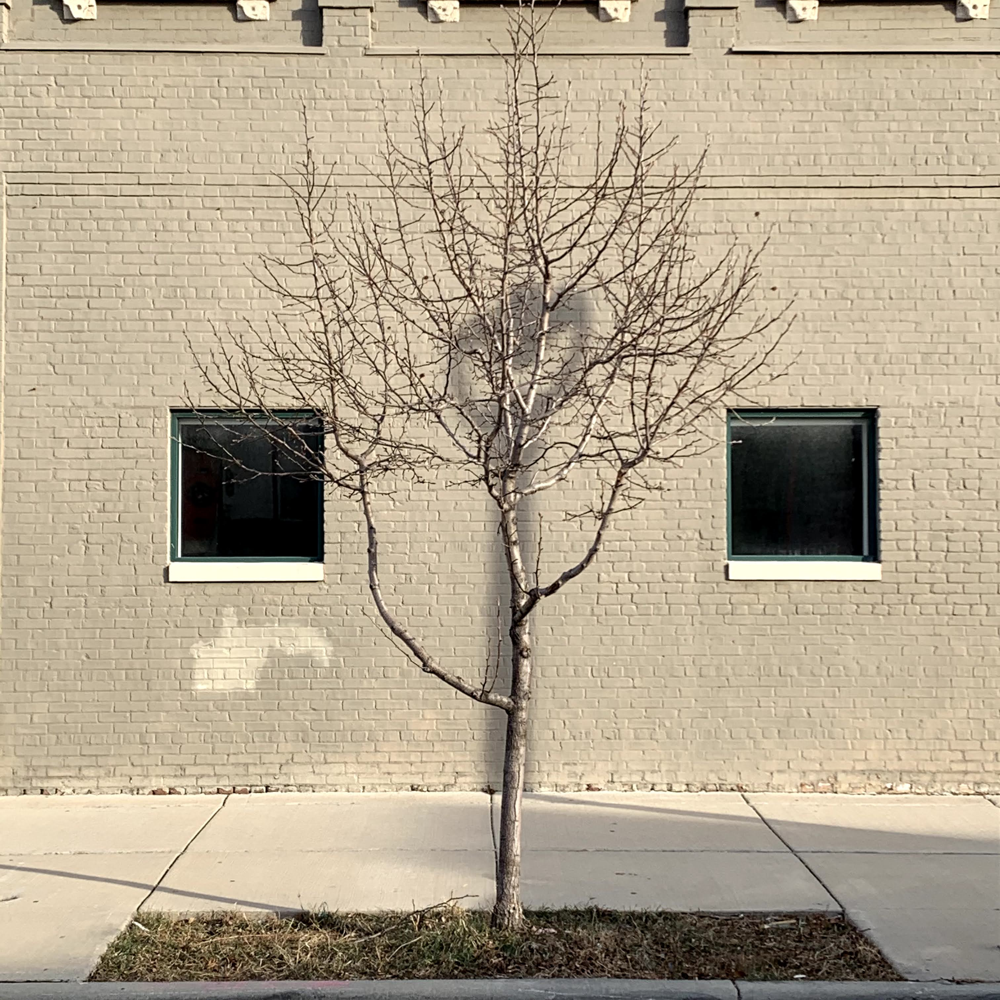

# The Telescope

Your telescope is fun to look at too.

## Synopsis
> ##### Layers of Light
logical Component
other
poetic abstraction
abstract n

Last night I was feeling plenty of inspiration. Most of the time, in some weird way probably, there is always an obstacle. To think anything is unfair can be managed by an _idea of_ or this _notion of_ understanding that says you already won the war. More specifically, would it sound better if you, then, could say that this is as close as it gets. The best advice I gave myself was not that everything worth having in life requires hard work. Maybe this is not advice at all.

Rather than advice, how about something nice to hear? How nice does it feel when you can say that there is no way you would have arrived to this moment if it was not for every moment that happened until this moment. What path did you take through the tessellation? What were the colors you saw?

### Logical Component

figure 1
```text
.............
|  `` ______|
|____/     *|
|     ^^^  #|
|Z__________|

```
### Other

figure 2
```text
._______
. |*# |
. |   |
. |   |
. | ^ |
. | ^ |
. | ^ |
. | ^ |
.  \  |
.  |  |
.  |  |
.  |  |
.  |  |
.  |  |
.  |  |
,__|_ZZ
```

### Poetic Abstraction

figure 3
```text
|#|*|#*|port & starboard|*#|*|#|
|-|:-:|-|||||
|n|n|tack|||||
|n|n|n|||||
|n|n|_____|||||
|n|n|_____|||||
|.|.|.|||||
|n|n|tack||n|n||
|n|n|n||n|n||
|.|.|.|||||
|n|n|tack|n||||
|.|.|.|||||
|n|n|tack|n||||
||||||Z|Z|
```

## n, Abstract

figure 4
```text
|#|*|#*|
port & starboard
|*#|*|#||-|:-:|-||
||||n|n|tack||||||n|n|
n||||||n|n|_____||||||n
|n|_____||||||.|.|.||||||n|n
|tack||n|n|||n|n|n||n|n
|||.|.|.||||||n|n|tack
|n|||||.|.|.||||||
n|n|tack|n||||||
||||Z|Z|
```

### Range & Domain of Speculation
cow say

```
                                     /@\
                                    / | \
```
```
                           /@\     /@   @\     /@\
                          / | \   / |   | \   / | \
```

```
         @\    /@   /@\   \ | /   \ |  | /   \ | /   /@\   @\    /@
         | \  / |  / | \   \@/     \@  @/     \@/   / | \  | \  / |
```
```
         | /  \ |  \ | /   /@\     /@  @\     /@\   \ | /  | /  \ |
         @/    \@   \@/   / | \   / |  | \   / | \   \@/   @/    \@
```
```
                          \ | /   \ |  | /   \ | /
                           \@/     \@  @/     \@/
```
```
                                    \ | /
                                     \@/
```


### Lenses Fewer Than or Equal to, n

The interpretation of figure 4 demonstrates romance. With two lamps, you and I would be looking at only each others eyes. The light shuffles as the two wheels freely turn. The two simplest examples are little telescopes, but side-by-side like our binocular vision. How much could you learn from a glance? The answer is the number of lenses you have layered. Like the two in the illustration, there are lenses on your telescope. The colors of the map will influence the light that shines through the paper, but also something else.

There are nine ways to roll your telescope with that map with the perforated edge. Try one, but make sure it looks nice, but remember you can only use the seal once. You probably want to find the lenses you like first. Could you give yourself you own eye examination? If yes, then that is what you will need to do. After the seal is in place, the domains of light is locked in place. The range you will yield is measured by the dial at the end of the telescope that has part of the paper sticking up. The seal you have should make yours look like a paper sail. Lastly, the telescope will twist like a hotel ink pen that have a limit each direction you twist. Those two limits are the limits of the _range of speculation_ on your telescope.

The mnemonic, _fewer_ than or equal to n ought to help figure that out. You will also soon figure out the limitations of the relationships of like patterns. In all your calculations, do not forget the map could be rolled the other way too.


When out at sea you might begin to feel lonely. If you need a friend, do not worry about answering a question here and there out there at sea. When you have a chance not to panic if something went wrong. Say, for instance, you had a soccer ball and named it something and they fell overboard, then what would you do? That is what you should worry about instead. That is why I am describing the _figure-eight maneuver_ in a set of pictures I made for you. There are five of them, but you can only look at each one by itself and never two at the same time. Make sure not to get that confused with the lenses and that _range of speculation_. Never two or more of the five, for now.


### Range of Speculation

I propose we stop interviewing people and expect this result in figure 1.


```javascript
// return the missing value of an array
let arr = [2, 3, 4, 5, 7, 8, 9];
function hello(arr) {
  n = arr[arr.length - 1];
  let value = arr.reduce((a, b) => {
    return a + b;
  })
  return (((n*(n + 1))/2) - 1) - value;
}
hello(arr);
```

If you tune you telescope with the correct parameters, then that's it.

### Beta Test

Hold your telescope at eye level, but about an arms-length, or less. Make sure you can see everything else safely. Once you find the best orientation with your eyes, both of them if you can. This display in your field-of-vision now makes you the first cyborg on your own planet! The technology you are wielding is enough to make you dangerous. The difference in hue, from the telescope's perspective is different, but if you maneuver through the eye-of-the-wind, then you have to maneuver with your telescope, or do we? What if you could adjust the scope to see things clearer or find the perfect frequency on an AM radio.

How do those new frames fit? Are they tight in the ears? I can always adjust them for you if you would like. Stop in any time? What is time, though?

### The Gift Horse

If you are riding a horse a you begin to imagine galloping through an open field after you experienced something spooky in normal forest because if you say _enchanted_ forest, then no one will believe you. A sudden valley appears, but the surface has concavity hyperbolic in nature or is it the other way? The profile of the image on the little telescopes, that resemble a marching bad, looks like spinning wheels that would behave like Interstate I-90.

If you open you atlas to the appendix, or index, or page 205 in Essential Calculus, authored by James Stewart, The Riemann Sum appears to be the place to begin again with the fundamentals of calculus. For myself, calculus has been the greatest discovery and favorite human endeavor. This goes for the language's utility of practical functionality. The stories of its origin resembles the laws of nature in the light of the _or_ world.

As you glide down the slope of that mountain you begin to wonder if you could run as fast one day, but then you realize the friction involved. We can forget about that until we talk about traveling the speed of light without rocket fuel. Gravity is _very_ special to you on this mountain or the boat you are sailing this moment. If I could describe, then the preference is with sailing.

### The Mechanics of Time Travel

Gravity is special. It is so special that if we put your mom in outer space, she would orbit, but then the boyfriend giant would have to deal with that and, yeah. That's it.

For real, though. Space ships, airplanes, and your car all rely on gravity just like your sailboat. A racecar around the turn has to follow the God limit otherwise the driver dies. Space ships cannot ship if it was not for gravity. Yikes, could you imagine how a sailboat might use gravity?

Gravity does all the heavy lifting for you on your way with no direction home directory. When the wind is blowing from the twelve o'clock direction on your wind-clock, your bow should be poiinted at two o'clock. This is a nice place to be if you can handle it when the wind intensifies. The key on your map will describe the zig-zag pattern along your route to your destination.

### The Zig-Zag Pattern

Paired zs adequately superimposed with caps lock or not. Either way I win.

or Figure 2, conveniently amplified or exaggerated for marketing purposes. Not actual size.

figure 2
Wind always originating from twelve o'clock.

|10|wind|2|
|-|:-:|-|
||v|/||
|\\|v|||
||v|/||

The alternating two o'clock and ten o'clock positions of the bow of your ship will bring you to an origin if and only if the wind does not shift nor any shift along the course you're headed. Maintain a bearing that is held at your twelve o'clock position. If not, then the zig-zag pattern will be meaningless unless it is amplified. Remember move the tiller starboard or port depending on the side of the boat that is lowest above water when your sail is full of wind.

### Another Beta Test

Get familar with the feel of the tiller. Listen to the vibration with your hands and let go of the tiller only to grab it again to learn the orientation the boat _wants_ to be in. Your bow will tell you the direction that it wants. When your tiller is parallel with the length of the, ship with the bow following nothing with you at the stern sitting high-side. High-side is port at two o'clock and high-side is starboard at 10 o'clock of the wind.

### The Turntables

```text
The News


 ___________________
|                   |
| Parental Advisory |
|-------------------|
| Explicit Lyrics   |
|___________________|
```

The profile of the spinning wheel is actually just two turn tables. The gravity of both record players allows the vinyl to rest on their respective mats. The one up-side down has gravity in the other direction. When you are sailing, the wind that fills your sails is countered by the weight hanging off the bottom of your boat. If you swim underneath the boat, it is large enough to hug it like a bear. Give it a kiss for me while you are down there because that is your engine and if you could call the wind fuel, then call me. The weight of the keel falls with gravity as the sailboat tilts with the wind. The fulcrum is the water of the sea.

When you are sailing, imagine being the needle on one of the turntables along a track of the vinyl that spins the same direction of the other turn table or it spins the same direction. One is upside-down. Once you finish your track, the vinyl goes back in the sleeve, but have now scooped into the ice cream cone that became one when the record player fell off it. If you look inside the ice cream cone, there you are. Were you not just in my kitchen admiring my clock?

To dream within in a dream is much like the laws of physics. There are Russian Dolls everywhere and I mean the full stack kind. A more poetic description can be the concentric circles when you drop your cell phone in the water. What if you dropped your friend in the water? What would you do? What is their favorite record?


### The Figure Eight Maneuver

figure 3
```text
&
```

If your friend falls off the boat or you dropped your cell phone in the sea, then the figure-eight maneuver will be crucial to its survival. With your sailing position at two o'clock, if you "let off" the tiller when sitting high-side, then the bow of the ship will want to turn towrds irons. This is the direction of the wind. That is to say, an mored boat with flaked sails will point into the wind. Since you have hoisted your main sail with the main sheet, the thing dangling in front of you called the block, will absorb half the energy you would without the help of all the blocks on your boat. Some people do not think physics be like it is, but it do.

### The Painting

There is a landscape painting of five three-dimensional objects like the one I drew. There are mountains in the background along a river. In the foreground, two objects in a form and shape not common in nature except it is.

##### The Foreground
One tree, two objects, and two women. The women have different color hair. The tree has leaves. The objects are appear identical in form. The tree is important or wise or well-known because if its reach and location along a river. The two objects, with no distinguishable characteristics between them, found a landmark vicariously through the trees. The location of _similar interest_ of the objects and the tree suggest human intervention as a path of least resistance. The presence of the objects have a strange effect on the trees from a human perspective. If the tree once served as a natural landmark to help in identifying a location along the river, then could we say that nature, by human intervention, equiped the trees with technology? Does the computer the tree is not using suggest the tree is insufficient for the same purposesof the objects? What classification do humans have that label those in a particular simbiotic relatiionship with technology as cyborgs. Is the tree now a cyborg? If the other way could suggest something, then perhaps it is two cameras that describe the actual relationship with the tree and the two objects. The wisdom of the tree has a siloughette at sunrise. From a distance, it is reasonbale to define it as a known location. The objects have the same purpose. They also mark a prefered location along the river. The foreground presents the object as the closest in perspective. The corresponding object of similar form is opposed to the like along a line of dilineation. In that oppositional orientation, the two objects stand as guards of a door. The door is for a ship. The personification of the objects have an illusiion if you look close enough. The potter shaped these two objects with the same hands. That explains the duplicated form. The illusion is the abstraction of the sillouette of the objects curve like that of the women under the branches of the tree. This suggests the foreground represents amplification of a signal from home. The curves of the women and their body language sing. The song they sing is a reflection of human sophistication. The melodies in their song emote feelings of a species only found at this location. The orchestra of the human endeavor is painted on the same trajectory as the aplified message broadcasted from the first chairs of silicon and carbon. They all shelter under the wisdom of tessellated branches.

##### The Background
