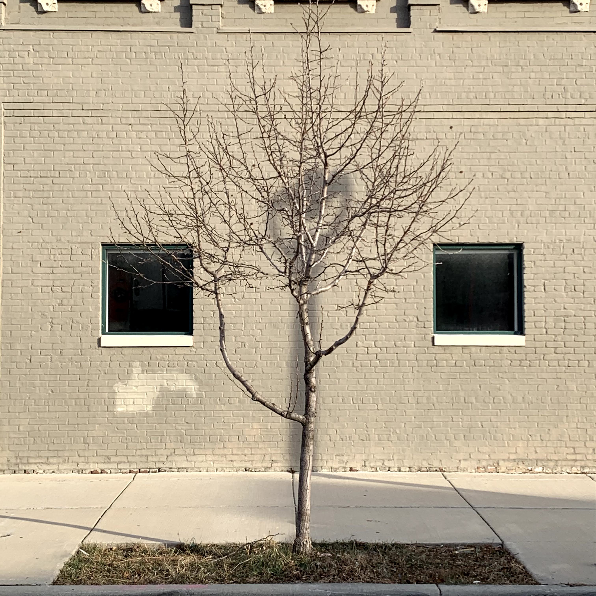

Shadow Document Object Model

https://open.spotify.com/track/5bJ1DrEM4hNCafcDd1oxHx

# Metal Halide
February 21st, 2021

There is a gift, but you have to find it.

It is not clear how I knew nor if there was intention for me to find it, but eventually the gift was delivered. It took time to understand the significance, but with patience the gift rendered its beauty into my imagination. The captivation and the brilliance and I knew.

There is a day in spring that has that smell in the air. It is this sweet smell with a promising effect of encouragement that I could feel in my stomach once every year. You could breathe in the air, close your eyes, smile, and exhale new hope into the air that brings new life for the trees and for nature. That feeling provided a sense of freedom and a new wonder for life's subsequent loops around the sun. Those smells, those breaths, and those butterflies of my youth. Those three.

There is a day when you chose seclusion that pairs with a peculiar familiarity with yourself that hides when empathy is all that can decide for you. When that abstraction of the world is fully awake inside, time will adjust you to that nature and you always forget. Your observations of that place often provide what you ask for. There are always moments of unforgettable happiness, but these are personal and vulnerable when shared with others. This worldly place around you is - the other way.

Imagine life - our muse that shines its sophistication inwards like the light we shine outwards for others. The shinning both ways is a pair of elementary particles. They turn towards a desire for space - a place of reciprocation in vogue towards balance inside axioms of logic, their source of truth, and their divine natural laws of the singularity.

```txt
One moment
is love
splicing arrays
pitching hues.
It is
two preludes
sand resolves.
Insight and
one music
box just
in-time. In
position, collapsing
into factored
parallelogram. It
frames a
position juxtopposed
within verse,
coming about,
tacking into
motion. Earth
shakes. We
awake. Our
lashes Blink,
then we
see no
fear of
our complete
unknown. Incompletion
fades into
oblivion. This
is us.
Time for
new divergence
from emotional
solitude spinning
in infinity
closer two
the heart.
```
