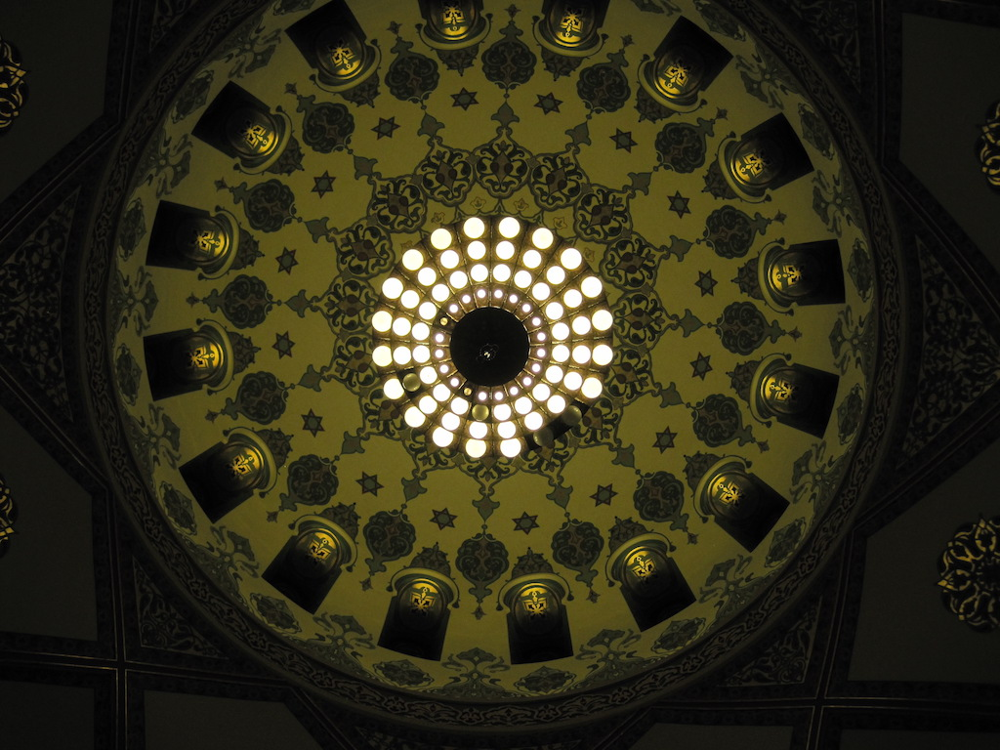

# The Breeze

Why do we have memories of ourselves from a distance?

We had an activity in kindergarten where we all sat in a circle and passed around something like a brown paper lunch bag. The items inside had different textures, but the fun was that you were not supposed to know what the thing was until everybody had a chance to reach inside the bag to check it out. The idea was to get creeped out, I guess, in a playful way. Thinking about this now, I try to imagine being the teacher and choosing the items. They were supposed to be common household items around the house, but here is where I actually get creeped out. What kind of texture would creep you out the most if you did not know what it was before touching it? The only thing I can think of is something slimy. What other types of harmless things of texture could you find to build up a such a suspense?

This was a grade school on the south side of Milwaukee, Wisconsin. This is where I grew up. There are a few other peculiar moments about Clement Avenue Elementary that did were forgotten until now, but many of them are still unclear. That Halloween thing we did, as children, just seems very creepy to me because it was not my kindergarten teacher that led the activity. It was a younger lady that has us all sit in that circle one day, and as we all were settling in, she turned off the lights in the classroom.

That day was the first time I saw myself outside my self. She turned off the lights to, perhaps, evoke some Halloween vibe, but it was the first time I was ever scared. I was two perspectives in that moment as if a ghost lifted out of my body. I watched from above as they passed around that paper bag, but the escape warped my peripheral vision as my ghost kept watch. The movement, the reverse, and the ascent.

Clement Avenue was my school up until, and including, the second grade. We played kickball at recess and the multiplication and division I was doing in kindergarten sort of kicked me off into that tangent apart from the other students. Regarding the peculiarities of my childhood included the windmill, the other schools in close proximity of each other, and the overwhelming emotion I would feel in moments unexpected.

Before your first day of school in kindergarten, I can only imagine there is plenty of preparation for that day, but for myself, it was very hurried. We were late that day and I can recall the anxiety the day before. There was not much thought put into that memory nor is there much to add to that, but for some reason, it just seems mysterious. In an effort to find meaning in that, my memory has a beginning. That duplex on Howard Avenue is when my life started for me here in this world until Ramon, my supposed dad at the time, casually pointed out the apartment we lived in before then.

The place where I apparently lived as a baby is somewhere in the St. Francis area of Milwaukee near Morgan Triangle park. It had a Cousin's Subs located underneath. Ramon was a flooring and carpet installation professional that was contracting with Sherwin Williams at the time. The idea that a paint wholesaler was in the carpet installation business was not that strange then. I mean, I asked why, but maybe it was because this was prior to 2008 before the economy crashed and people had all sorts of money to spend on their investment properties. There we were, installing carpet. Him and I worked on many apartments throughout that city, but one day we just coincidentally were assigned a job to replace the flooring in that apartment building.

He was excited to tell me about it, but this type of excitement brought no new knowledge nor revealed anything about my life before the place on Howard Ave. When he mentioned this, I asked plenty of questions as I usually do, but that was all to learn that day. He just wanted me to know, I guess. Have you ever walked into a vacant room, or a vacant house, or a vacant place where someone lived, but felt something the moment you entered? Maybe it is a vibe, or maybe the way the place looks, or maybe some abstraction of Feng Shui. In any regard, there was some subtlety there that satisfied my intuition, as I was in that building that allowed me to believe him. The impression stayed with me the entire ride home. My intuition was starting to tell me more about my life and where I was from, but was I listening close enough? Was I ready to know?

The more I look back, the more my memories become something else. If that is true, then perhaps recollection is precisely as its name space intends to contain - the action of collecting all that has been overlooked or misunderstood in your past. Assuming that type of introspection has scope, the new interpretation of any given moment of your life will add to another. This process might then be a new balance. Writing this now provides a deeper understanding of the visualization I imagined for your atlas - the tessellation of color, of form, and of light.

There are a few more of these that are worth sharing, but what is the cause of this imagery we have in our minds in memory. The first time I prayed for anything was in that childhood home. The two of us were kids, my cousin and I, but we wanted some chocolate milk. There is no memory I have of learning how to pray, nor can I claim that nobody showed me how, but I did. It was clear to me, then, that no chocolate milk was provided for us while we played together that day nor was there any chocolate milk available at home on a regular basis. So, I prayed for it. It happened with little effort because the two of us were already on our knees playing with some toy cars or something, but I remember putting my hands together and asking God for some chocolate milk. My cousin watched as I did this, but when I open my eyes and looked up, he was smirking in an intriguing way probably wondering what was next. In the kitchen, I found it where I expected. The joy I had was unforgettable.

As kids do, we hurried to find our cups to sit down, but this miracle provided something else for the two of us other than the milk. He asked me how. It felt good to show him how to pray. Maybe he asked hoping to just talk about it. The recollection of this moment is recalled through him. As in, when I begin to remember this prayer, I see it through his eyes exactly where he was with me in that hallway with the toy cars scattered about. When I stood up and headed for the kitchen the memory returns to my own perspective. The beautiful thing is that now I know. Those moments in recollection though the perspective of another is God in you, but it goes further than that.

One day in Mexico, we were on vacation when I found a sailboat on the shore of the ocean. It was a small dinghy, a Hobie Cat to be precise, but there it was ready to launch. These boats are similar to catamarans in that they have two hulls with no keel. The lack of a keel is what defines a dinghy type sail boat - as opposed to a larger vessel, moored out in the water, that cannot be brought ashore. This makes for a nice recreational type craft that seems to be designed for ease of use, learning purposes, and affordable repairs.

God was with me on that water in the Pacific Ocean the day my boat capsized. The owner of the boat was happy to take me out a few times before this moment, but first he had to teach some safety techniques. For example, how to recover from capsizing. He made sure I was aware of the halyard, which is the sheet that hoists the the sail up towards the masthead, and how this sheet is then ran across the masthead sheave, that spins, allowing the halyard to run back down the mast and tied to a horn cleat and knotted with a cleat hitch.

In the event of a capsize, the main halyard can be used as leverage to right the boat. You must position your feet against the bottom of the hull as you pull on the halyard. The recovery is slow to start because the main sail is submerged in the water, but as your bodyweight begins to pull on the halyard, the vessel is eventually brought upright. From there the challenge is getting back into a dinghy safely.

On the Pacific Ocean, the waves were more aggressive than what I was used to on the fresh water of Lake Mendota at the University of Wisconsin. You can see across that lake, but it is deep enough to be dangerous in some weather.

...brb
